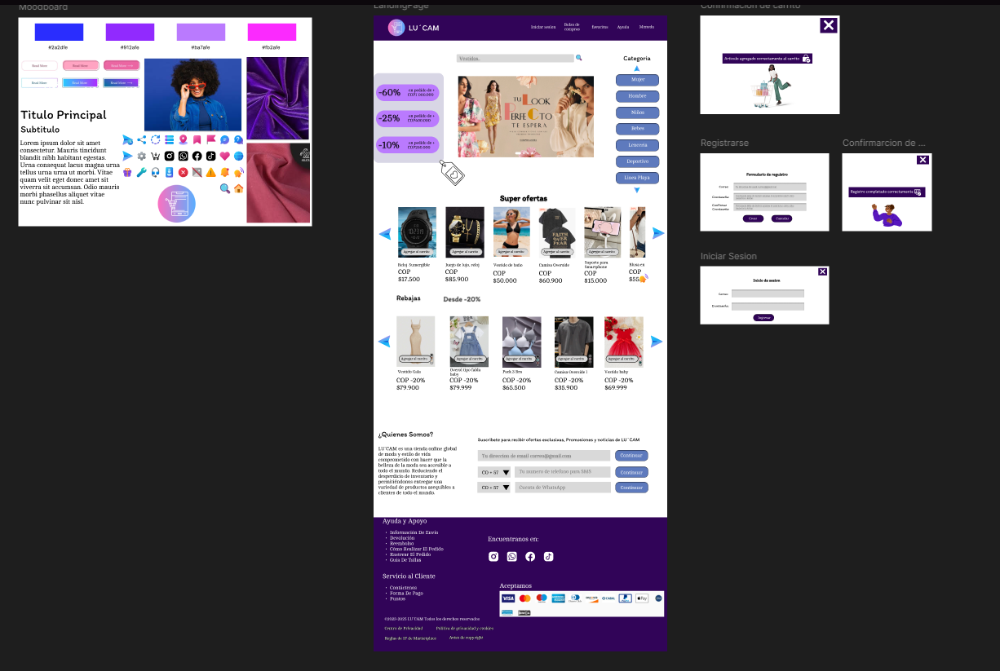

# Proyecto sobre Tienda virtual
## introduccion
Con el sitio se busca alojar stock de mercancia, control de ventas e inventario y fidelización de los clientes que ingresen a mirar los productor.

[Cami-GitHub] {https://github.com/camilovega10/bit-1}
[Cami-Figma] {https://www.figma.com/design/CWmKu7ZmdfKlEdARCw3ybp/Untitled?node-id=0-1&t=CZLJNlQzfKtoLcyx-1}

## Autor
Cristian Camilo Vega Parra 7/05/2025# bit-1
